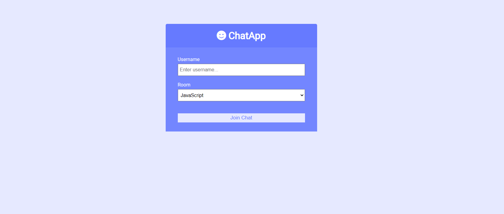

# real-time-chat
## Description 
This app is built to create a chat application where users are able to join rooms, send and receive messages.
## Table of Contents
- [Instructions](#instructions)
- [Usage Information](#usage-information)
- [Built With](#built-with)
- [Question](#question)
## Instructions
- clone this repository.
- Download Node.js at [https://nodejs.org/en/download/](https://nodejs.org/en/download/)
- Using npm to install required node modules by using **npm install** in the command line.

## Usage Information
Run `node server.js` in the command line or access this

[Link](https://van-tech-blog-app.herokuapp.com/) for a deployed application.

# Built With
- Socket.IO
- Node.js
- Express.js
- JavaScript

## Question
If you have any additional questions about this project, Feel free to reach me at [vantam8300@gmail.com](vantam8300@gmail.com).
For more of my project, please visit [https://github.com/vantam8300](https://github.com/vantam8300)